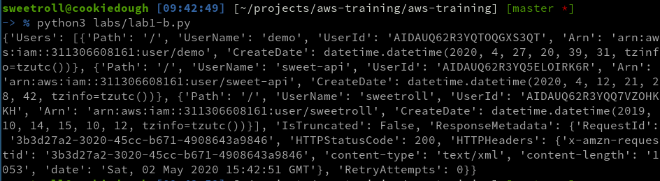
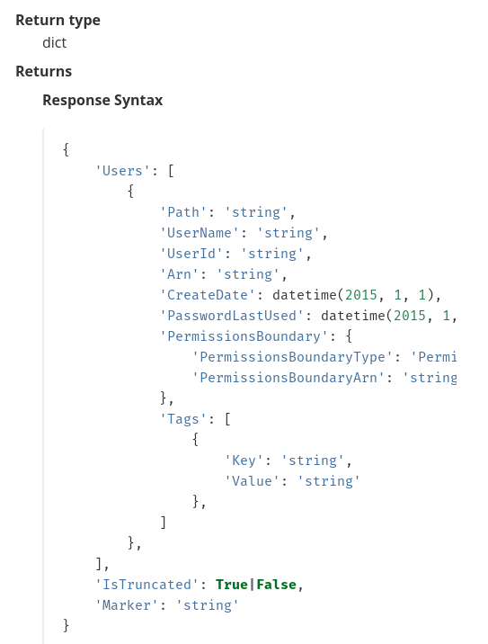
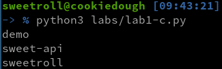

# Prerequisites
This article makes a few assumptions. First, that you understand the basics of Amazon Web Services (AWS) and have hands-on experience with some key services. Second, that you have some basic experience developing scripts in Python or another language. Last, you will need to install python3 and pip. 

# What is Boto3?
[Boto3](https://aws.amazon.com/sdk-for-python/) is an extensive python library for AWS. It allows you to script the management of an AWS cloud environment and has some incredible documentation [here](https://boto3.amazonaws.com/v1/documentation/api/latest/index.html). You will need to reference these documents often, so keep them handy!

# Getting started
There are multiple ways to install the boto3 library. Let's use pip!

```
pip3 install --user boto3
```

Boto3 also requires valid API keys to get started. If you've already set up the AWS CLI with _aws configure_ then you should be good to go. Otherwise, check out the guide [here](./cli-1.md)

Here is an example of how you might use boto3 to list [IAM](./iam-1) users. You can find this and the other code examples on [Github](https://github.com/sw33tr0ll/aws-training/labs/lab1.py)

```
#!/usr/bin/env python3
import boto3
print(boto3.client('iam').list_users())
```

# Getting _even more_ started
The above example will work, but it's not the most elegent. Let's try again, and break it down line-by-line. 

```
#!/usr/bin/env python3		 # declares the file a python3 script
import boto3			 # imports the boto3 library (thanks pip!)
iam_client = boto3.client('iam') # creates an object called "iam_client" using boto3
raw_response = iam_client.list_users() # runs the iam_client's list_users method and assigns it to a variable
print(raw_response)		 # prints the response
```

Creating objects and variables in our code like this is the "more correct" way to script with boto3. It makes it easier to troubleshoot issues, build upon your scripts, and move things around. The example above looks good, but the response is still a bit ugly! 



Consulting the boto3 documentation (**note:** you want to do this often!) shows that the response format for this request is a Python dictionary.



Let's break this down. The base response is a dictionary, which includes a bunch of metadata and a list of users. Each user in the list is **also** a dictionary with information like the username, unique ID, and date of creation.

We don't want all that nonsense though! We want user names. We can get them by taking the raw response, extracting the list of users, going through that list of users, and extracting the username from each user. Here's what that looks like in code. 

```
#!/usr/bin/env python3
import boto3
iam_client = boto3.client('iam')
raw_response = iam_client.list_users()

# so far, the code is the same, but we want to work that raw_response variable down

user_list = raw_response['Users'] 	# extracts the list of users from the raw response
for user in user_list:			# goes through each user in the list
    print(user['UserName'])		# prints the username of the user
```

This response looks a lot nicer. 



##[Next, let's play with scripting S3 buckets!](boto3-2-s3)
