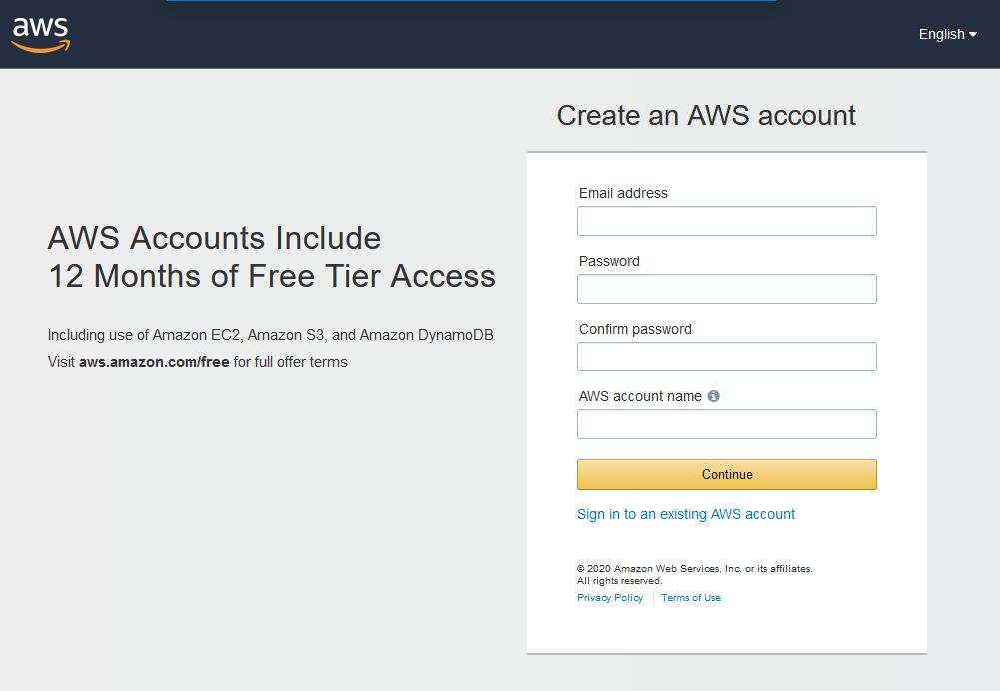

# Some AWS training
To-be high-quality training / hexacon talk covering:
-- Intro to cloud computing concepts
-- Key AWS Services
-- Designing Effective AWS Solutions for Infosec work
-- The AWS Console and CLI
-- AWS Automation with the Python Boto3 SDK

## Header 2

> This is a blockquote following a header.
>
> When something is important enough, you do it even if the odds are not in your favor.

If you don't already have an AWS Account:
https://portal.aws.amazon.com/billing/signup#/start

